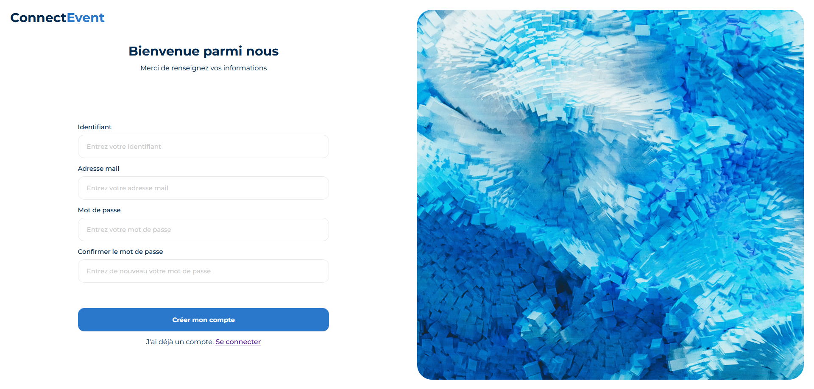
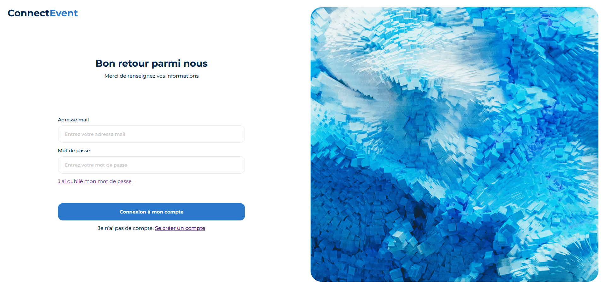

# ConnectEvents

ConnectEvents est une application web développée en PHP qui permet aux utilisateurs de gérer des événements et d'interagir avec d'autres utilisateurs. Il offre des fonctionnalités telles que la création d'événements, l'inscription à des événements, un système de blog et un gestionnaire de contacts.

## Fonctionnalités principales

- 🔖 Création, affichage et gestion d'événements : Les utilisateurs peuvent créer des événements, consulter les détails des événements existants et s'inscrire pour y participer.
- 📝 Blog intégré : Un système de blog simple permet aux utilisateurs de publier des articles, de les commenter et de les gérer.
- 📇 Gestionnaire de contacts : Les utilisateurs peuvent ajouter, afficher, modifier et supprimer des contacts dans leur carnet d'adresses.
- 🔒 Sécurité des données : Les mots de passe des utilisateurs sont stockés de manière sécurisée grâce à un hachage fort, assurant la confidentialité et l'intégrité des données.

## Configuration et installation

1. Clonez ce dépôt sur votre machine locale.
2. Configurez la base de données en important le fichier de structure fourni.
3. Modifiez le fichier de configuration pour y indiquer les paramètres de connexion à la base de données.
4. Déployez l'application sur votre serveur PHP.

## Captures d'écran

#
## Licence

Ce projet est sous licence [MIT](./mit_license.md). Vous pouvez utiliser, modifier et distribuer ce code conformément aux conditions de la licence.

N'hésitez pas à nous contacter pour toute question ou suggestion. Nous espérons que vous apprécierez l'utilisation de ConnectEvents !
